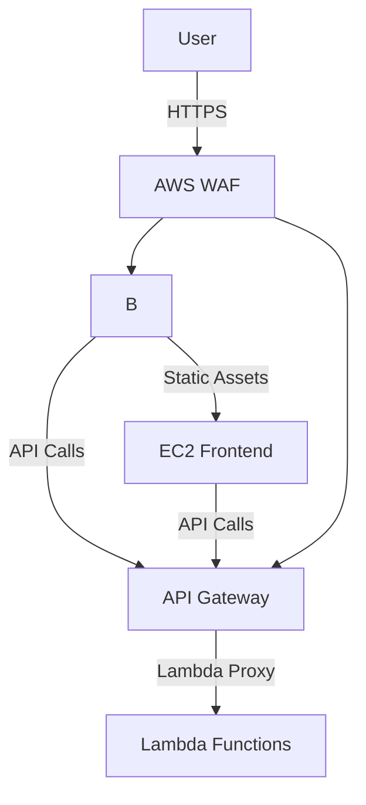

# **Cloud Architecture Documentation**  

## **Overview**  
This project implements a **secure**, **scalable**, and **high-performance** cloud architecture using:  
- **EC2** for frontend hosting  
- **CloudFront** as a global CDN  
- **API Gateway & Lambda** for backend services  
- **AWS WAF** for security protection  

---

## **Architecture Diagram**  


---

## **Components**  

### **1. Frontend (EC2)**  
- **Purpose**: Hosts the web application  
- **Tech Stack**:  
  - NGINX/Apache for static file serving  
  - React/Angular/Vue for dynamic content  
- **Features**:  
  - Auto-scaling group for high availability  
  - Deployed in multiple AZs  

### **2. Content Delivery (CloudFront)**  
- **Purpose**: Accelerates content delivery globally  
- **Configuration**:  
  - Origin: EC2 Load Balancer (for dynamic content) + S3 (for static assets)  
  - Caching policies optimized for web apps  
  - HTTPS enforced (TLS 1.2+)  

### **3. Backend (API Gateway + Lambda)**  
- **Purpose**: Serverless API for business logic  
- **Tech Stack**:  
  - API Gateway (REST/HTTP)  
  - Lambda (Node.js/Python/Java)  
- **Features**:  
  - JWT/OAuth authentication  
  - Rate limiting via Usage Plans  

### **4. Security (AWS WAF)**  
- **Purpose**: Protects against web exploits  
- **Enabled Rules**:  
  - **Rate Limiting**: Blocks >10 requests/min per IP  
  - **OWASP Core Rules**: SQLi, XSS, etc.  
  - **IP Reputation Lists**: Block known malicious IPs  
- **Deployment**:  
  - Attached to **CloudFront** and **API Gateway**  

---

## **Deployment Steps**  

### **1. Frontend (EC2 Setup)**  
```bash
# Example NGINX setup (Amazon Linux)
sudo yum install nginx -y
sudo systemctl start nginx
sudo systemctl enable nginx
```

### **2. CloudFront Configuration**  
- **Origin**: EC2 Load Balancer DNS or S3 bucket  
- **Behaviors**:  
  - Cache static assets (`/static/*`)  
  - Forward API requests (`/api/*`) to API Gateway  

### **3. Backend (Serverless Deployment)**  
```bash
# Deploy Lambda + API Gateway via SAM
sam build
sam deploy --guided
```

### **4. WAF Rules**  
- **Console**: AWS WAF → Create WebACL → Attach to CloudFront/API Gateway  
- **Terraform Example**:  
```hcl
resource "aws_wafv2_web_acl" "main" {
  name        = "rate-limiting-acl"
  scope       = "REGIONAL" # Or CLOUDFRONT
  default_action { allow {} }
  rule {
    name     = "RateLimitRule"
    priority = 1
    action { block {} }
    statement {
      rate_based_statement {
        limit              = 100
        aggregate_key_type = "IP"
      }
    }
  }
}
```

---

## **Testing**  
### **1. Verify WAF Rate Limiting**  
```bash
# Test with 20 rapid requests
for i in {1..20}; do 
  curl -s -o /dev/null -w "Request $i: HTTP %{http_code}\n" https://your-cloudfront-url/
done
```
**Expected Result**: Requests blocked (HTTP 403) after 10 requests/minute.  

### **2. Load Testing**  
```bash
# Install hey (HTTP load tester)
go install github.com/rakyll/hey@latest

# Run test (50 requests, 5 concurrent)
hey -n 50 -c 5 https://your-api-gateway-url/api/endpoint
```

---

## **Cost Optimization**  
- **EC2**: Use Spot Instances for non-critical workloads  
- **Lambda**: Right-size memory/timeout settings  
- **CloudFront**: Leverage cache hit ratios to reduce origin calls  

---

## **Security Best Practices**  
- 🔒 **Encryption**: Enable TLS everywhere (CloudFront, API Gateway)  
- 🛡️ **WAF**: Regularly update rules (e.g., AWS Managed Rules)  
- 🔍 **Monitoring**: CloudWatch Alerts for abnormal traffic  

---

## **Troubleshooting**  
| Issue | Solution |
|-------|----------|
| WAF not blocking | Check scope (CLOUDFRONT vs REGIONAL) |
| API Gateway 504 | Increase Lambda timeout |
| CloudFront 403 | Verify origin permissions |

---

**📌 Maintained by**: [Your Team Name]  
**🔗 Reference**: [AWS Well-Architected Framework](https://aws.amazon.com/architecture/well-architected/)
